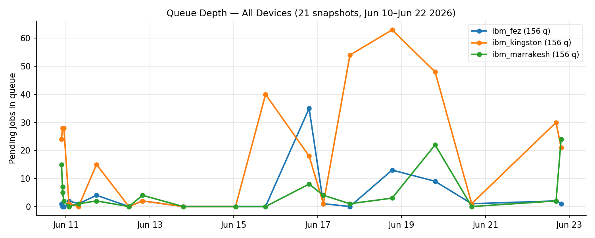
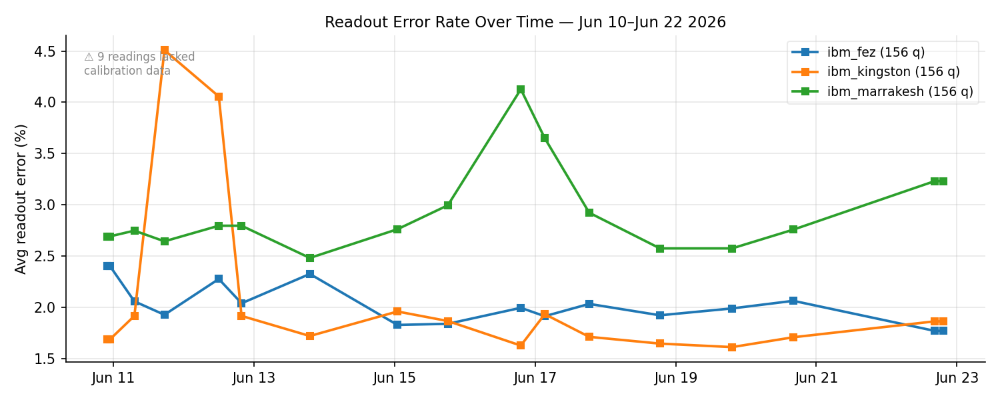
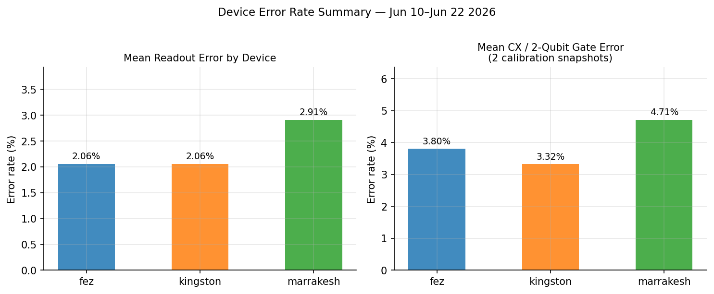

# State of the IBM Quantum Fleet
**Report generated:** 2026-06-22 20:08 UTC
**Data window:** 2026-06-10 21:27 UTC – 2026-06-22 19:19 UTC (11.9 days)
**Devices monitored:** ibm_fez, ibm_kingston, ibm_marrakesh (all 156-qubit Eagle-class)
**Snapshots collected:** 21 polling intervals × 3 devices = 63 rows

---

## Executive summary

All three monitored backends remained operational throughout the 12-day observation window.
Queue depths varied, peaking at 63 pending jobs on ibm_kingston.
Readout error rates were broadly stable across devices, with ibm_fez showing
the best average performance. CX (two-qubit gate) error data is newly available following
a bug fix on 2026-06-22 and should be treated as early-stage data, not a trend.

---

## Devices in scope

| Device | Qubits | Class | Operational throughout? |
|--------|--------|-------|------------------------|
| ibm_fez | 156 | Eagle r3 | Yes |
| ibm_kingston | 156 | Eagle r3 | Yes |
| ibm_marrakesh | 156 | Eagle r3 | Yes |

No device reported `operational = False` during the observation window.

---

## Chart 1 — Queue depth over time

**Findings:**

- Peak queue depth was **63 pending jobs** on ibm_kingston (18:37 UTC Jun 18).
- ibm_fez had the lightest average queue load (mean 3.5 jobs), making it the most accessible backend on average.
- Queue depth is volatile on timescales of minutes; these readings reflect point-in-time snapshots, not sustained load.

---

## Chart 2 — Readout error rate over time

**Findings:**

- ibm_fez had the **lowest mean readout error** across the window (2.06%, range 1.77–2.41%).
- ibm_marrakesh had the highest mean readout error (2.91%, range 2.48–4.13%).

**Data note:** 54 of 63 device-readings included readout error data.
9 readings returned NULL — these are excluded from all calculations.

---

## Chart 3 — Error rate summary

**CX (two-qubit gate) error observations (2 calibration snapshots):**

| Device | Snapshot | CX error |
|--------|----------|----------|
| ibm_fez | 2026-06-11 01:43 UTC | 3.35% |
| ibm_fez | 2026-06-22 19:19 UTC | 4.25% |
| ibm_kingston | 2026-06-11 01:43 UTC | 2.98% |
| ibm_kingston | 2026-06-22 19:19 UTC | 3.67% |
| ibm_marrakesh | 2026-06-11 01:43 UTC | 4.11% |
| ibm_marrakesh | 2026-06-22 19:19 UTC | 5.31% |

Note: CX error data was absent from historical snapshots due to a gate-name mismatch
(Eagle devices use ECR, not CX). This was fixed on 2026-06-22. Trend analysis will
become possible once several more snapshots accumulate.

---

## Data quality and gaps

| Issue | Affected rows | Detail |
|-------|--------------|--------|
| Missing readout error | 9/63 readings | Early snapshots; API returned no calibration data |
| Missing CX error (historical) | 57/63 readings | ECR gate not matched by old `g.gate == 'cx'` filter — fixed 2026-06-22 |
| Near-duplicate snapshots | 2 pair(s) | Two snapshots within 2 minutes — likely a retry or double-fire |

All NULL values are stored as-is in `devices.db`. No imputation or forward-filling applied.

---

## Snapshot inventory

- 2026-06-10 21:27 UTC
- 2026-06-10 22:02 UTC
- 2026-06-10 22:03 UTC
- 2026-06-10 22:50 UTC
- 2026-06-11 01:42 UTC
- 2026-06-11 01:43 UTC
- 2026-06-11 07:13 UTC
- 2026-06-11 17:29 UTC
- 2026-06-12 12:02 UTC
- 2026-06-12 19:48 UTC
- 2026-06-13 19:07 UTC
- 2026-06-15 01:01 UTC
- 2026-06-15 18:12 UTC
- 2026-06-16 19:08 UTC
- 2026-06-17 03:18 UTC
- 2026-06-17 18:28 UTC
- 2026-06-18 18:37 UTC
- 2026-06-19 19:14 UTC
- 2026-06-20 16:09 UTC
- 2026-06-22 16:26 UTC
- 2026-06-22 19:19 UTC

---

## Recommendations

1. **Allow CX error to accumulate.** The ECR/CX bug was fixed on 2026-06-22. Wait for
   5–7 more snapshots before drawing conclusions from the CX trend.
2. **Deduplicate near-simultaneous snapshots.** 2 near-duplicate pair(s) detected.
   Add a guard in `snapshot.py` to skip writes when a snapshot for the same window already exists.
3. **Extend the collection window.** IBM calibration cycles run 24–48 hours; 12 days
   of data is a reasonable baseline.

---

*Generated automatically from `devices.db`. All statistics computed from raw snapshot values,
no smoothing applied. IBM Quantum hardware characteristics are subject to change without notice.*
